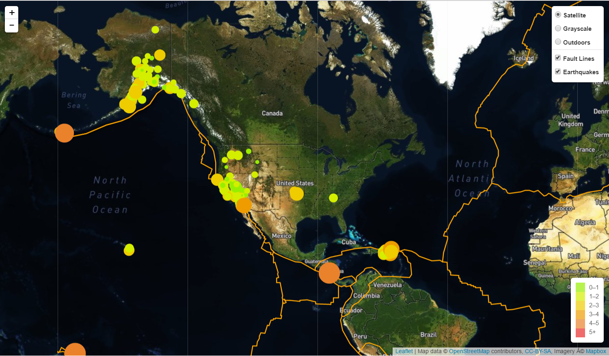

# Unit 17 | Assignment - Visualizing Data with Leaflet

## Background

The USGS is interested in building a new set of tools that will allow them visualize their earthquake data. They collect a massive amount of data from all over the world each day, but they lack a meaningful way of displaying it. Their hope is that being able to visualize their data will allow them to better educate the public and other government organizations (and hopefully secure more funding..) on issues facing our planet.

## Project Output

### Visualization

The output is a visualization of an earthquake data set. A second data set on the map will illustrate the relationship between tectonic plates and seismic activity. 

 ## Dataset used

   

   The earthquake data set is from The USGS of weekly earthquake data [USGS GeoJSON Feed](http://earthquake.usgs.gov/earthquakes/feed/v1.0/geojson.php)  'All Earthquakes from the Past 7 Days'.

   

  Data on tectonic plates can be found at <https://github.com/fraxen/tectonicplates>.

- - -

## Note to user : Please insert API Key in config.py file in order to run this program.

- - -

## Copyright

Axander Wilson  (C) 2018. All Rights Reserved.
